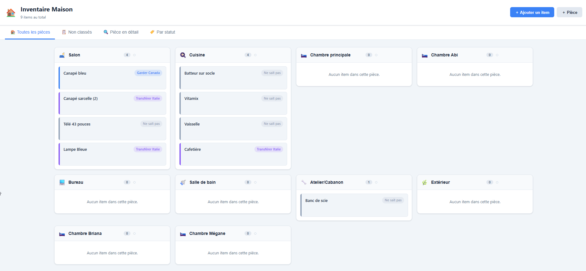
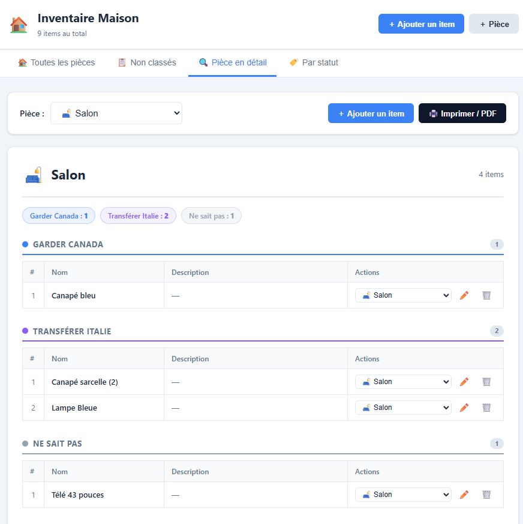
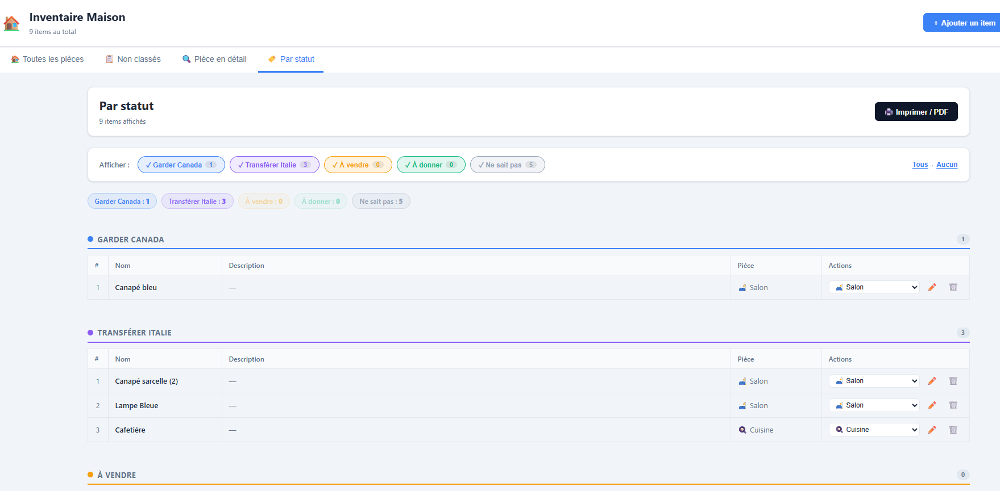
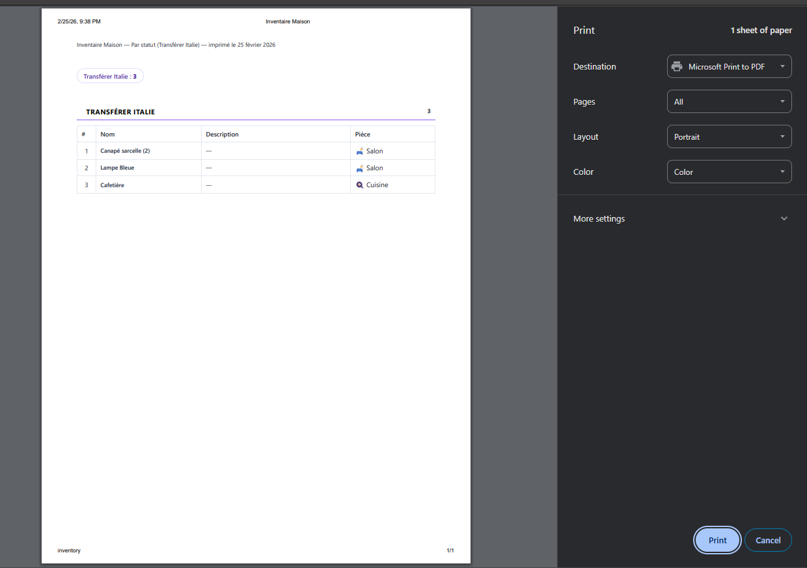

# 🏠 Inventaire Maison

Application web pour gérer l'inventaire de vos biens par pièce, avec gestion des statuts (Garder Canada, Transférer Italie, À vendre, À donner…).

---

## 📸 Aperçu

### Vue d'ensemble — Toutes les pièces


### Vue détaillée — Par pièce


### Vue par statut avec filtres


### Export / Impression PDF


---

## ✨ Fonctionnalités

| Fonctionnalité | Détail |
|---|---|
| **Items** | Ajouter, modifier, supprimer |
| **Statuts** | Ne sait pas · À vendre · À donner · Garder Canada · Transférer Italie |
| **Pièces** | 8 pièces par défaut, personnalisables (nom + icône emoji) |
| **Déplacer** | Réassigner un item à une pièce via menu déroulant |
| **Vue Toutes les pièces** | Grille de toutes les pièces, avec mise en avant d'une pièce au clic |
| **Vue Non classés** | Items sans pièce assignée |
| **Vue Pièce en détail** | Sélecteur de pièce + tableau groupé par statut |
| **Vue Par statut** | Filtres par statut (toggle), tableau avec colonne Pièce |
| **Export PDF** | Impression via le navigateur (CSS d'impression dédié) |
| **Persistance** | Sauvegarde locale dans `data/inventory.json` |

---

## 🚀 Démarrage rapide

### Prérequis

- [Node.js](https://nodejs.org/) 20+
- [Docker](https://www.docker.com/) (optionnel)

### Développement local

```bash
# Installer les dépendances
npm install

# Démarrer le serveur API (port 3001) + Vite (port 5173)
npm run dev
```

L'application sera disponible sur **http://localhost:5173**

---

## 🐳 Docker

### Démarrage simple

```bash
docker compose up -d
```

### Reconstruire après modifications

```bash
docker compose up -d --build
```

### Arrêter

```bash
docker compose down
```

Les données sont persistées dans `./data/inventory.json` (volume monté).

---

## 🌐 Accès via hostname personnalisé (`http://inventory`)

Cette app est configurée pour fonctionner derrière un reverse proxy nginx existant sur le même réseau Docker.

### 1. Ajouter l'entrée dans le fichier hosts

**Windows** (PowerShell en administrateur) :
```powershell
Add-Content 'C:\Windows\System32\drivers\etc\hosts' "`n127.0.0.1`tinventory"
```

**Linux / macOS** :
```bash
echo "127.0.0.1  inventory" | sudo tee -a /etc/hosts
```

### 2. Ajouter le virtual host nginx

Dans votre `nginx.conf`, ajouter :

```nginx
upstream inventory {
    server inventory:80;
}

server {
    listen 80;
    server_name inventory;

    location / {
        proxy_pass http://inventory;
        proxy_http_version 1.1;
        proxy_set_header Host $host;
        proxy_set_header X-Real-IP $remote_addr;
        proxy_set_header X-Forwarded-For $proxy_add_x_forwarded_for;
    }
}
```

### 3. Connecter au réseau nginx

Dans `docker-compose.yml`, adapter `proxy-net` avec le nom de votre réseau Docker existant :

```yaml
networks:
  proxy-net:
    external: true
    name: <nom-du-reseau-nginx>
```

---

## 🗂️ Structure du projet

```
Inventory/
├── src/
│   ├── components/
│   │   ├── ItemCard.tsx          # Carte d'un item
│   │   ├── ItemModal.tsx         # Formulaire ajout/édition item
│   │   ├── RoomCard.tsx          # Carte d'une pièce
│   │   ├── RoomDetailView.tsx    # Vue détaillée par pièce + PDF
│   │   ├── RoomModal.tsx         # Formulaire ajout/édition pièce
│   │   └── StatusView.tsx        # Vue par statut avec filtres + PDF
│   ├── context/
│   │   └── InventoryContext.tsx  # État global + persistance API
│   ├── App.tsx                   # Mise en page principale + navigation
│   ├── index.css                 # Styles + CSS d'impression
│   ├── main.tsx                  # Point d'entrée React
│   └── types.ts                  # Modèles de données TypeScript
├── data/
│   └── inventory.json            # Données persistées (gitignored)
├── server.cjs                    # Serveur Express (API + fichiers statiques)
├── Dockerfile                    # Multi-stage build
├── docker-compose.yml
└── vite.config.ts
```

---

## 📊 Statuts

| Statut | Couleur |
|---|---|
| 🔵 Garder Canada | Bleu |
| 🟣 Transférer Italie | Violet |
| 🟡 À vendre | Orange |
| 🟢 À donner | Vert |
| ⚫ Ne sait pas | Gris |

---

## 📄 Ajouter les captures d'écran

Pour compléter ce README :

1. Ouvrir l'app dans le navigateur (`http://inventory` ou `http://localhost:5173`)
2. Prendre des captures d'écran de chaque vue
3. Créer le dossier `docs/screenshots/` et y déposer :
   - `all-rooms.png`
   - `room-detail.png`
   - `by-status.png`
   - `print-preview.png`
4. `git add docs/ && git commit -m "docs: add screenshots" && git push`
